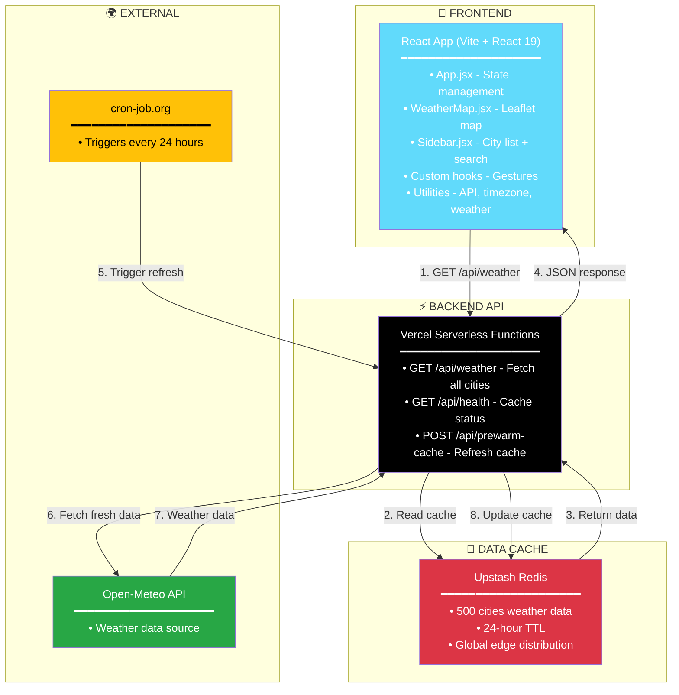

# 🌍 Hazard Map

Global weather visualization dashboard displaying real-time weather data for 500+ cities on an interactive map.

## 🏗️ Architecture



## ✨ Features

- Interactive map with marker clustering
- Real-time weather data (temperature, wind, conditions)
- Search, filter, and sort cities
- Mobile-optimized with smooth gestures
- Accurate local time for each city

## 🚀 Tech Stack

**Frontend:** React 19, Vite 7, Leaflet, tz-lookup
**Backend:** Vercel Serverless, Upstash Redis
**Data:** Open-Meteo API (free, no API key needed)

## 📦 Setup

```bash
npm install
npm run dev
```

## 📂 Project Structure

```
src/
├── components/       # React components
├── hooks/           # Custom gesture hooks
├── services/        # API client
├── utils/           # Helper functions
├── data/            # City data
└── App.jsx          # Main app
```

## 🔄 How It Works

1. **Cron** → Refreshes cache every 24 hours
2. **Frontend** → Fetches cached weather from API
3. **Users** → Browse map, search cities, see weather

## 🛠️ Commands

```bash
npm run dev          # Start dev server
npm run build        # Build for production
npm run lint         # Run ESLint
```

---

**Built with React + Vite + Leaflet**
