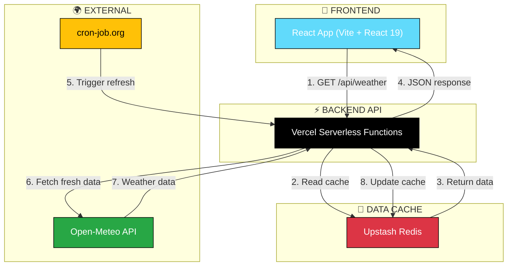

```mermaid
graph TB
  subgraph FRONTEND["🎨 FRONTEND"]
    APP["React App (Vite + React 19)"]
  end

  subgraph BACKEND["⚡ BACKEND API"]
    API["Vercel Serverless Functions"]
  end

  subgraph CACHE["💾 DATA CACHE"]
    REDIS["Upstash Redis"]
  end

  subgraph EXTERNAL["🌍 EXTERNAL"]
    OPEN["Open-Meteo API"]
    CRON["cron-job.org"]
  end

  APP -->|"1. GET /api/weather"| API
  API -->|"2. Read cache"| REDIS
  REDIS -->|"3. Return data"| API
  API -->|"4. JSON response"| APP

  CRON -->|"5. Trigger refresh"| API
  API -->|"6. Fetch fresh data"| OPEN
  OPEN -->|"7. Weather data"| API
  API -->|"8. Update cache"| REDIS

  style APP fill:#61dafb,color:#fff,stroke:#000,stroke-width:1px
  style API fill:#000,color:#fff,stroke:#000,stroke-width:1px
  style REDIS fill:#dc3545,color:#fff,stroke:#000,stroke-width:1px
  style OPEN fill:#28a745,color:#fff,stroke:#000,stroke-width:1px
  style CRON fill:#ffc107,color:#000,stroke:#000,stroke-width:1px
```